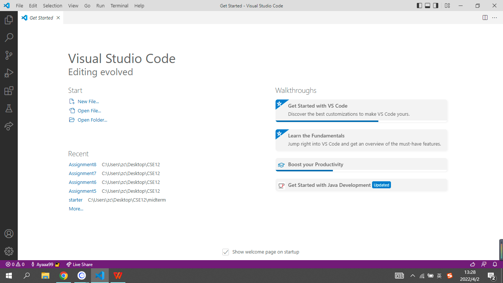
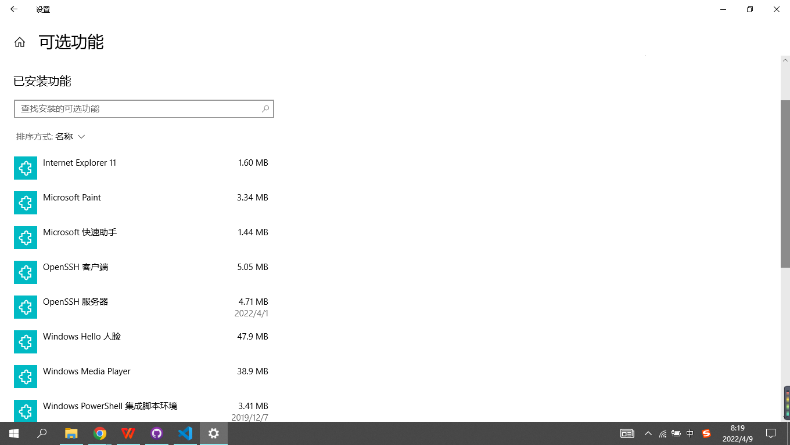
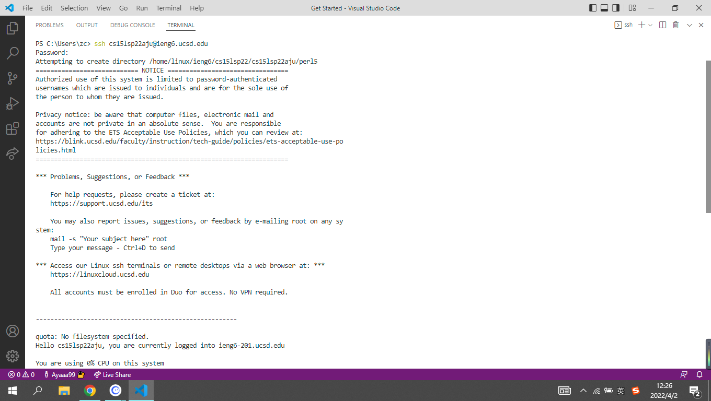
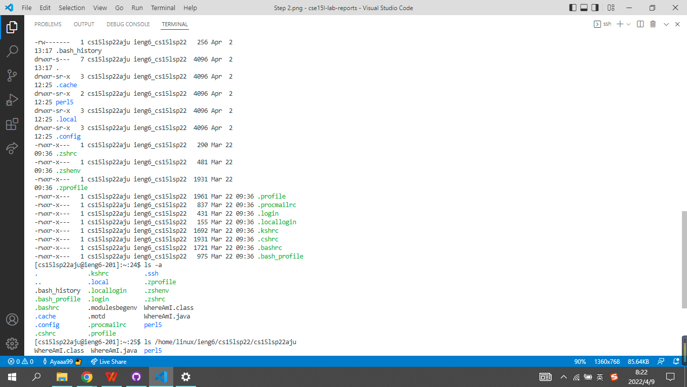
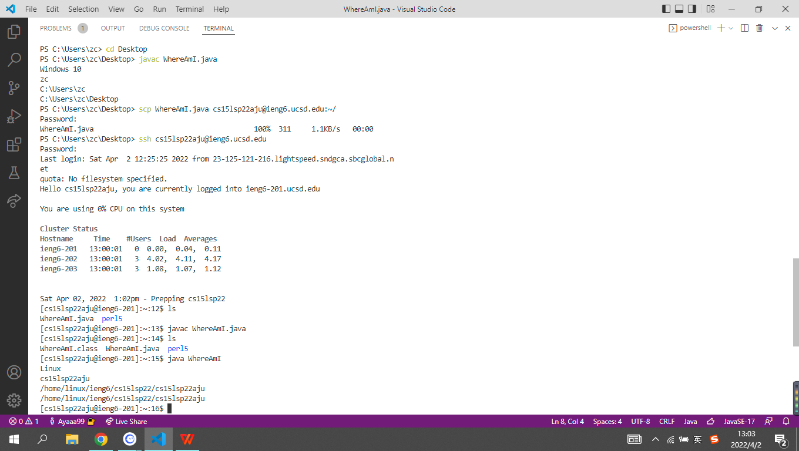
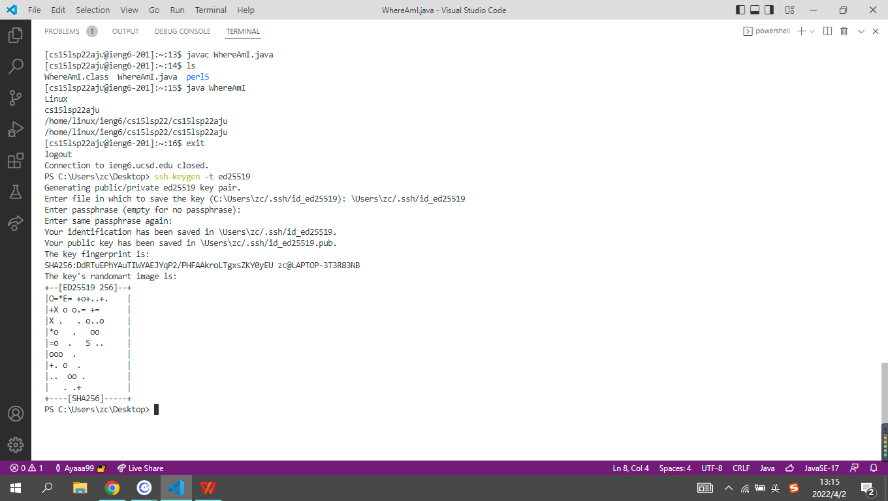
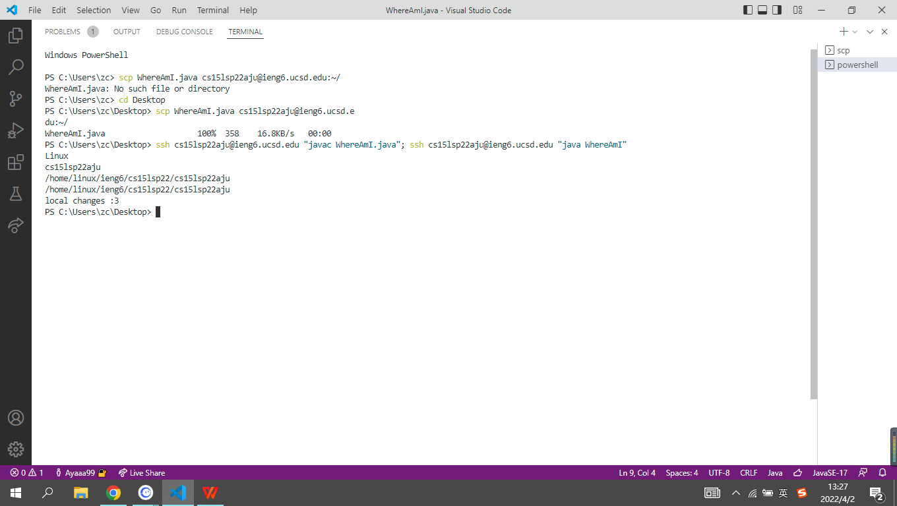

# A tutorial to log into cse15l account on ieng6
**Step 1: Download and install VScode**
Search VScode on google and install it to your computer. When you finished installing VScode and open it, it should look like this.

**Step 2: Install OpenSSH and connect to ieng6 server**
Check whether OpenSSH is installed on your computer. If not, install it to your optional features. 

Find your account for CSE15L and log in to the ieng6 server through ssh.

**Step 3: Basic commands**
Try out some basic command on the ieng6 server, such as cd, ls, pwd, mkdir, and cp.

**Step 4: Use scp to copy files**
Copy a file from your local computer to remote computer using the scp command. You will run it from your computer without logging into ieng6.

**Step 5: Set up ssh key**
Set up a ssh key on your client, so you don't need to provide password everytime to log in to your ieng6 account.

**Step 6: Covenient way to make changes**
Try to run your command directly on the remote server using the ssh command. Compare it to your orignal process to run the command and consider which one is more convenient.

*Congrats, you've finished this tutorial!*
